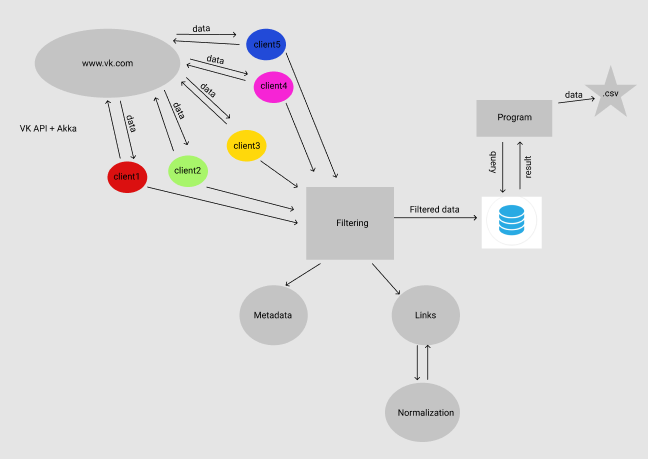

# VK WEB 2.0 Crawler

### Стек инструментов разработки
Java, PostgreSQL, Akka, VK API

### Архитектура

### Команда
Менеджер: ``Асташенкова Лада``  
Разработчик: ``Щеникова Снежана``  
Инженер QA: ``Толмачев Виктор``  
Помощник разработчика: ``Ли Цзин``

#### Затраченное время  
#### Разработчик:  
1.Работа с API VK: 
5 часов  
2.Разработка программы:
15 часов  
3.Разработка взаимодействия с БД:
3 часа  
4.Тестирование вручную:
3 дня
