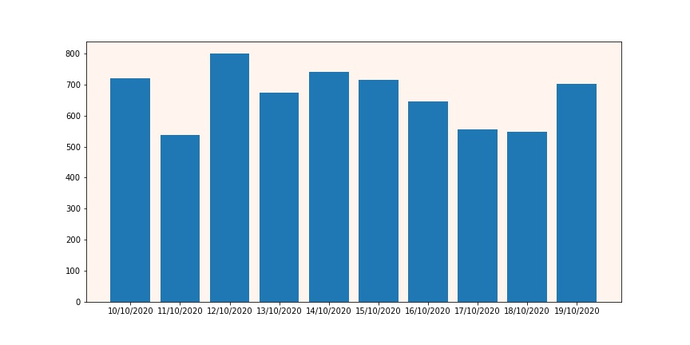
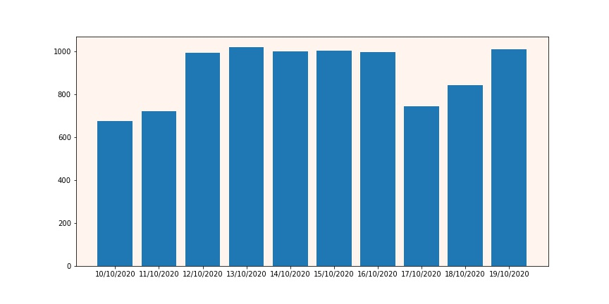

# VK WEB 2.0 Crawler

### Стек инструментов разработки
Java, PostgreSQL, Akka, VK API

### Архитектура


### Команда
Менеджер: ``Асташенкова Лада``  
Разработчик: ``Щеникова Снежана``  
Инженер QA: ``Толмачев Виктор``  
Помощник разработчика: ``Ли Цзин``

#### Затраченное время  
#### Разработчик:  
1.Работа с API VK: 
5 часов  
2.Разработка программы:
15 часов  
3.Разработка взаимодействия с БД:
3 часа  
4.Тестирование вручную:
3 дня

### Результаты
В ходе работы разработан VK crawler, позволяющий собирать данные по публикациям об университетах СПбГУ и МГУ по 
5 основным запросам: "спбгу", "spbu", "мгу", "mgu", "Lomonosov Moscow State University" за выбранный промежуток времени.
Статистические данные можно найти в папке ```data```:   
```Total data.csv``` -  количество  публикаций  об  упоминании университета, количество  публикующих  контент  пользователей;  
```mguData.csv```,```spbuData.csv``` - данные для построения графика по количеству публикаций в день за собираемый период.
Количество   лайков/просмотров/комментариев/репостов можно получить путем запроса к БД.  

##### Данные по СПБГУ


##### Данные по МГУ

